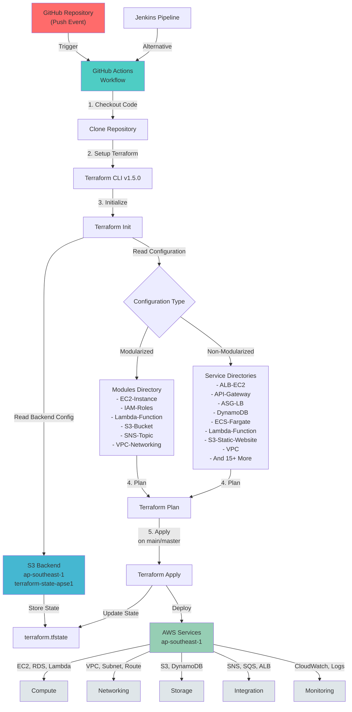

# Terraform-for-AWS

This repository contains Terraform configurations for deploying various AWS services using modular and non-modular implementations.

## Table of Contents

- [Introduction](#introduction)
- [Architecture & Flow Diagram](#architecture--flow-diagram)
- [Terraform AWS Infrastructure](#Terraform-AWS-Infrastructure)
- [Non-Modularized](#Non-Modularized)
- [Modularized](Modularized)
- [Services Configured](#services-configured)
- [Getting Started](#getting-started)
- [Automating with Jenkins](#automating-with-jenkins)
- [Automating with GitHub Actions](#automating-with-github-actions)
- [Contributing](#contributing)
- [License](#license)
- [Contact](#contact)

## Introduction

This repository provides infrastructure-as-code configurations written in Terraform for deploying and managing a variety of AWS services. The configurations are organized into modular and non-modular implementations to offer flexibility and reusability.

## Architecture & Flow Diagram

### Workflow Steps:
1. **Push to Repository**: Code changes trigger GitHub Actions workflow
2. **Setup**: Terraform CLI is installed and configured
3. **Initialize**: Backend (S3) is configured, modules are downloaded
4. **Plan**: Review infrastructure changes
5. **Apply**: Deploy resources to AWS ap-southeast-1 region
6. **State Management**: Infrastructure state is stored in S3 bucket with DynamoDB locking

### Backend Configuration:
- **Bucket**: `terraform-state-apse1` (ap-southeast-1)
- **State Lock**: DynamoDB table `Lock-Files`
- **Encryption**: Enabled
- **Versioning**: Enabled

# Terraform AWS Infrastructure

This repository contains Terraform configurations to provision various AWS services for infrastructure deployment. The configurations are organized into two directories: "Non-Modularized" and "Modularized."

## Non-Modularized

The "Non-Modularized" directory includes configurations and projects that do not follow a modular implementation approach. It contains Terraform files that directly define the resources and their configurations for provisioning AWS services. This approach is suitable for smaller projects or when modularity is not a primary requirement.

## Modularized

The "Modularized" directory contains configurations that follow a modular implementation approach. It leverages Terraform modules to encapsulate and reuse infrastructure components across different projects. Each module represents a specific AWS service or a group of related services, allowing for easier management, scalability, and reusability of infrastructure code. This approach is recommended for larger projects or when there is a need for flexibility, maintainability, and modularity.

## Services Configured

The Terraform configurations in this repository allow you to deploy the following AWS services:

- EC2 instances
- VPC (including route table and subnets)
- RDS (Relational Database Service)
- DynamoDB
- Lambda functions
- CloudWatch Logs
- CloudWatch Events
- CloudWatch Metric Alarms
- CloudWatch Subscription Filters
- Key pairs
- Lambda layers
- S3 buckets
- ECS (Elastic Container Service)
- ALB (Application Load Balancer)
- NLB (Network Load Balancer)
- ASG (Auto Scaling Group)
- SNS (Simple Notification Service)
- SQS (Simple Queue Service)
- IAM roles
- Glue (AWS Glue)
- Snapshot (EBS snapshots)
- ECS Fargate
- Route53
- Cloudfront
- Certificate Manager,etc

## Getting Started

To get started with deploying the AWS services using Terraform, follow these steps:

1. Clone this repository to your local machine.
2. Install Terraform (version X.X.X) from the official Terraform website [here](https://www.terraform.io/downloads.html).
3. Configure your AWS credentials by setting the necessary environment variables or using the AWS CLI `aws configure` command.
4. Navigate to the desired service directory within the repository.
5. Run `terraform init` to initialize the Terraform workspace.
6. Run `terraform plan` to review the planned infrastructure changes.
7. Run `terraform apply` to apply the Terraform configurations and provision the AWS resources.

## Automating with Jenkins

If you prefer automating the deployment process using Jenkins, you can leverage the provided Jenkins pipeline file (`Jenkinsfile`). This file contains the necessary steps to automate the Terraform deployment pipeline with Jenkins. Configure your Jenkins instance and set up a pipeline job using the `Jenkinsfile` to automate the infrastructure provisioning process.

## Automating with GitHub Actions

Alternatively, you can automate the deployment process using GitHub Actions. The repository includes a GitHub Actions pipeline file (`terraform.yml`). This file defines the workflow for automatically running Terraform commands when changes are pushed to the repository. To enable GitHub Actions, create appropriate secrets or adjust the pipeline configuration to suit your requirements.

## Contributing

Contributions to this repository are welcome! If you have any improvements or additional services to include, please feel free to submit a pull request. Ensure that the changes align with the repository's guidelines and best practices.

## License

This project is licensed under the [MIT License](LICENSE).

## Contact

If you have any questions, suggestions, or feedback, please feel free to contact the project maintainer at [aman.pathk23@gmail.com](mailto:aman.pathk23@gmail.com).
